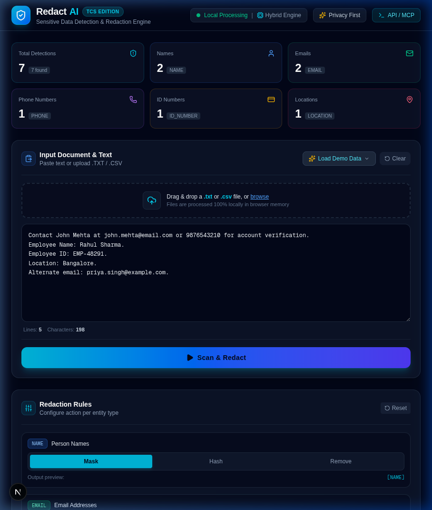

# RedactAI — Sensitive Data Detection & Redaction Engine

> **TCS Hackathon Project** • Built with Next.js, React, TypeScript, and Tailwind CSS.
> 100% Client-Side In-Memory Processing • Zero Database • Zero External API Locks.



---

## Executive Summary

**RedactAI** is an enterprise-grade sensitive personal data detection and redaction platform designed to detect, highlight, categorize, and anonymize Personally Identifiable Information (PII) from unstructured text and documents.

It incorporates a modular **Hybrid Detection Engine** combining high-precision deterministic regular expressions with contextual heuristics and synthetic entity dictionaries. Sensitive data can be dynamically masked, hashed with deterministic cryptographic SHA-256 tokens, or stripped entirely, with granular audit reporting.

---

## Core Capabilities & Requirements Matrix

| Requirement | Implementation Status | Technical Details |
| :--- | :--- | :--- |
| **Document/File Ingestion** | Fully Implemented | Drag & Drop + File Explorer for `.txt` and `.csv` files. Clear error validation for unsupported extensions. |
| **Instant Demo Input** | Fully Implemented | Large monospace text editor pre-loaded with default TCS benchmark text; 6 synthetic industry presets (KYC, Healthcare, HR, CSV, Negative). |
| **Supported Entities** | Fully Implemented | **NAME**, **EMAIL**, **PHONE**, **ID_NUMBER** (Aadhaar, PAN, Employee IDs), and **LOCATION**. |
| **Detection Engine Architecture** | Fully Implemented | Modular `HybridDetectionEngine` orchestrating `RegexDetectionProvider` and `ContextDetectionProvider`, designed for future NER/LLM plugins. |
| **Confidence Scoring** | Fully Implemented | Scores range 0–100% (e.g. 99% for RFC Email, 98% for PAN, 95% for labeled Name/ID, 94% for 10-digit mobile). |
| **Location Tracking** | Fully Implemented | Human-readable location reporting (e.g., `Line 1, characters 9–18`) derived from exact byte offsets. |
| **Redaction Modes** | Fully Implemented | Configurable per entity type: **MASK** (`[NAME]`), **HASH** (`[HASH:8a3f5c1d]`), and **REMOVE** (clean deletion). |
| **Original vs Redacted View** | Fully Implemented | Interactive side-by-side split panels with color-coded syntax highlighting and hover badges. |
| **Detection Audit Report** | Fully Implemented | Interactive audit table with entity badges, partial masking toggle (`Jo*** M***a`), location, confidence meters, and action labels. |
| **Export & Interoperability** | Fully Implemented | One-click **Download Redacted File** (`.txt` or `.csv`) and **Copy Redacted Text** to clipboard. |
| **Success Metrics & Benchmark** | Fully Implemented | Live mathematical calculation of **Detection Recall (100%)** and **False Positive Rate (0%)** against 10 synthetic test cases. |
| **Edge Case Safeguards** | Fully Implemented | Gracefully handles empty inputs, non-PII text ("No sensitive data found"), malformed strings, and large payloads (>500k chars). |
| **REST API / MCP Tooling** | Fully Implemented | Exposes `POST /api/redact` endpoint for external agents, workflows, and automated pipeline integration. |

---

## Architecture Overview

```
tcs/
├── app/
│   ├── api/
│   │   └── redact/
│   │       └── route.ts          # REST endpoint: POST /api/redact
│   ├── globals.css               # Dark cybersecurity SaaS styling
│   ├── layout.tsx                # Enterprise layout & SEO metadata
│   └── page.tsx                  # Main reactive dashboard container
├── components/
│   ├── ApiModal.tsx              # Interactive API / MCP specification modal
│   ├── DetectionReport.tsx       # Audit table with privacy toggle & filters
│   ├── EvaluationPanel.tsx       # Benchmark runner with live Recall & FP metrics
│   ├── MetricsCards.tsx          # Top overview statistics counters
│   ├── Navbar.tsx                # Header branding & local status indicators
│   ├── OriginalVsRedacted.tsx    # Split-view with entity syntax highlights
│   ├── PrivacyModal.tsx          # Client-side privacy architecture modal
│   ├── RedactionSettings.tsx     # Entity rule configuration (Mask/Hash/Remove)
│   └── UploadPanel.tsx           # Drag & drop upload, presets, and text input
├── lib/
│   ├── demo-data.ts              # Preset synthetic scenarios (KYC, HR, CSV, etc.)
│   ├── detection/
│   │   ├── engine.ts             # HybridDetectionEngine orchestrator
│   │   ├── utils.ts              # Line/character tracking & overlap resolution
│   │   └── providers/
│   │       ├── context-provider.ts # Contextual heuristics & entity dictionary
│   │       └── regex-provider.ts   # RFC email, phone formats, PAN, Aadhaar, EMP IDs
│   ├── evaluation/
│   │   ├── evaluator.ts          # Mathematical Recall & False Positive calculator
│   │   └── test-cases.ts         # 10 ground-truth synthetic benchmark cases
│   └── redaction/
│       ├── engine.ts             # Deterministic substitution engine
│       └── hasher.ts             # In-memory pure TypeScript SHA-256 hasher
├── types/
│   └── index.ts                  # Strong TypeScript models & interfaces
├── test-engine.ts                # Command-line benchmark & test suite runner
└── package.json
```

---

## Quick Start (Run Locally)

### 1. Install Dependencies
```bash
npm install
```

### 2. Launch Development Server
```bash
npm run dev
```
Open [http://localhost:3000](http://localhost:3000) in your web browser.

### 3. Run Benchmark Test Suite
```bash
npm test
```
Executes the CLI test runner across the 10 synthetic test cases and verifies regex, contextual detection, redaction modes, and edge cases.

### 4. Production Build Verification
```bash
npm run build
```

---

## API & MCP Tool Integration

RedactAI exposes an automated endpoint for agentic frameworks, CI/CD security linters, and MCP tools.

### Endpoint: `POST /api/redact`

#### Request Payload:
```json
{
  "text": "Contact John Mehta at john.mehta@email.com or 9876543210 for account verification. Location: Bangalore.",
  "rules": {
    "NAME": "MASK",
    "EMAIL": "HASH",
    "PHONE": "MASK",
    "ID_NUMBER": "MASK",
    "LOCATION": "MASK"
  }
}
```

#### Example cURL:
```bash
curl -X POST http://localhost:3000/api/redact \
  -H "Content-Type: application/json" \
  -d '{"text": "Contact John Mehta at john.mehta@email.com or 9876543210. Location: Bangalore.", "rules": {"EMAIL": "HASH"}}'
```

#### Response Payload:
```json
{
  "success": true,
  "originalText": "Contact John Mehta at john.mehta@email.com or 9876543210. Location: Bangalore.",
  "redactedText": "Contact [NAME] at [HASH:f3ecb8f5] or [PHONE]. Location: [LOCATION].",
  "detections": [
    {
      "id": "context-name-phrase-8-18",
      "type": "NAME",
      "value": "John Mehta",
      "start": 8,
      "end": 18,
      "lineNumber": 1,
      "charRange": "Line 1, characters 9–18",
      "confidence": 93,
      "explanation": "Actionable contact context (\"Contact [Name] at...\")",
      "provider": "ContextDetectionProvider"
    },
    {
      "id": "regex-email-22-42",
      "type": "EMAIL",
      "value": "john.mehta@email.com",
      "start": 22,
      "end": 42,
      "lineNumber": 1,
      "charRange": "Line 1, characters 23–42",
      "confidence": 99,
      "explanation": "Exact RFC email pattern match",
      "provider": "RegexDetectionProvider"
    }
  ],
  "stats": {
    "total": 4,
    "byType": { "NAME": 1, "EMAIL": 1, "PHONE": 1, "ID_NUMBER": 0, "LOCATION": 1 },
    "processingTimeMs": 2.19,
    "characterCount": 78
  }
}
```

---

## Privacy & Ethical Guarantee
- **100% Local In-Browser Processing:** In the primary web interface, processing occurs within browser volatile memory. No text is transmitted or logged to cloud servers.
- **Strictly Synthetic Data:** All test cases, preset scenarios, and demonstration dictionaries use synthetic, anonymized identities. No real personal records are stored or referenced.
